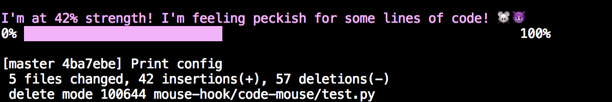

# Codemouse

A tamagotchi mouse for `git` that feeds on lines of code. 

```
git commit -m 'Print config'
```


```
git commit -m 'Update img'
```


## Requirements
* Git
* Python 3

## Install
```
pip install codemouse
```

## Usage

```
# Get usage instructions
codemouse
codemouse --help

# Navigate to git repository
cd /path/to/git/repo/parent

# Initialize codemouse to feed off this repo
codemouse init

# View your mouse's health
codemouse health

# View your mouse's feeding history
codemouse log

# View active projects
codemouse list -o projects

# View config
codemouse list -o config
```

## Notes
* The mouse works using the post-commit command hooks across active projects, found in your local repository's `.git/hooks` directory
* Application memory is kept in `$HOME/.codemouse`

## Developing
```
# Using python3 virtualenv
$ virtualenv venv
$ source venv/bin/activate

# Clone repo
$ git clone git@github.com:morganecf/code-mouse.git

# Run install script
$ cd code-mouse/mouse-hook/code-mouse
$ pip install -e .

# Use as above
$ cd /path/to/git/repo/parent
$ codemouse init
```
